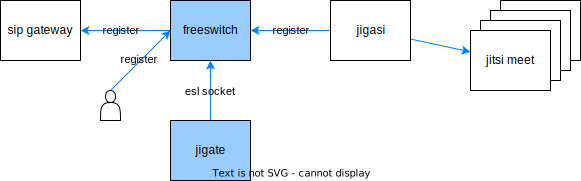

# Jigate services

[](jigate.drawio.svg)

## Jigate

The [jigate](jigate) directory contains the configuration and Docker file of a FreeSWITCH service
which serves as a SIP gateway for [jigasi].
It can register to a SIP gateway service or allows a user or gateway to register.
It receives calls for [jitsi meet] and is controlled by the [jigatecon](#jigatecon) esl service.

## Jigatecon

The jigatecon service controls the behavior of the [jigate](#jigate) FreeSWITCH instance.
SIP participants can control their mute and raised hand status.

The service uses [node-esl] and is written in **TypeScript**.
It is based on the following tutorials:

- [How To Set Up a Node Project With Typescript]:
  The full set up, except installing modesl and @types/modesl instead of express.
- [How to Set Up a Node.js Project with TypeScript]:
  Use of @tsconfig/node16, @types/node, ts-node, .eslintignore and .vscode.
- [Developing applications for FreeSWITCH]

## Setup

To setup jigate using [docker-jitsi-meet]:

1. Build the Docker images:

    ```shell
    ./build.sh
    ```

1. Copy the [jigate.yml](jigate.yml) file to your `docker-jitsi-meet` deployment directory.
1. Add the environment vars from [jigate.env](jigate.env) to your `.env` file.
1. In `docker-jitsi-meet` run:

    ```shell
    docker-compose -f docker-compose.yml -f jigasi.yml -f jigate.yml up -d
    ```

## Test

1. Register a SIP client to the [jigate](#jigate) service at `<sip:127.0.0.1;transport=udp>` as `"<Display name>" <sip:user@meet.jitsi>`
1. Call `sip:<meeting id>@127.0.0.1`.

[Developing applications for FreeSWITCH]: https://medium.com/makingtuenti/developing-applications-for-freeswitch-fccbe75ada81
[docker-jitsi-meet]: https://github.com/jitsi/docker-jitsi-meet
[How To Set Up a Node Project With Typescript]: https://www.digitalocean.com/community/tutorials/setting-up-a-node-project-with-typescript
[How to Set Up a Node.js Project with TypeScript]: https://blog.appsignal.com/2022/01/19/how-to-set-up-a-nodejs-project-with-typescript.html
[jigasi]: https://github.com/jitsi/jigasi
[jitsi meet]: https://github.com/jitsi/jitsi-meet
[node-esl]: https://github.com/englercj/node-esl
[PBX]: https://en.wikipedia.org/wiki/Business_telephone_system#Private_branch_exchange
